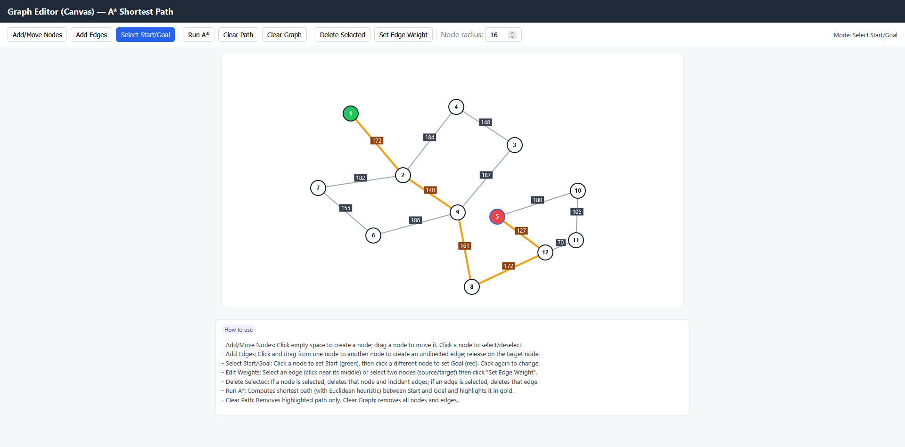

# Simple Graph Tool (with A* algorithm)
A simple graph editor that allows you to add vertices and edges and compute the shortest path using the A\* algorithm. All code is in a single `index.html` file written in plain JavaScript.

